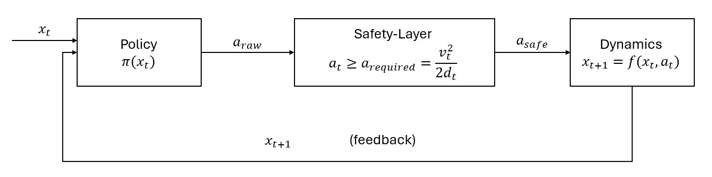

# SAFE-RL-Brake-Controller
A RL braking controller that must stop a vehicle safely under varying road conditions (friction, slope, noise) without ever crashing, using a safety layer that overrides dangerous actions.

---

# Theory

## 1. What system are we controlling?

A 1-D vehicle that moves in a straight line toward an obstacle and is able to apply braking force.  
The goal is to model the longitudinal motion (speed + distance).

**State variables:**
- $v$: vehicle speed (m/s)
- $d$: distance to the obstacle (m)
- $\mu$: road friction coefficient

**Control input:**
- $a$: acceleration (m/s²) (in this case negative due to braking)

The control problem can be defined as:  
“Given the current speed and distance to an obstacle, apply braking to stop safely and efficiently, under various road conditions.”

---

## 2. Friction

Friction determines the maximum braking acceleration:

$$
a_{\max,\text{friction}} = \mu g
$$

Due to friction the control problem becomes multi-conditional, e.g. good braking on dry asphalt can turn into sliding on ice.

---

## 3. Vehicle Dynamics

Assuming the car is a simple point-mass model, we use discrete-time updates:

$$
\begin{aligned}
v_{t+1} &= v_t + a_t\Delta t \\
d_{t+1} &= d_t + v_t\Delta t
\end{aligned}
$$

where $\Delta t$ is the simulation time step.

---

## 4. Stopping Distance

The ideal stopping distance for constant deceleration is:

$$
d_{\text{stop}} = \frac{v^2}{2|a|}
$$

If friction limits the deceleration to $a = \mu g$, then:

$$
d_{\text{stop}} = \frac{v^2}{2 \mu g}
$$

---

### 4.1. Mathematical Background

Fundamental quantities of motion:

- **Position:**  
  $x(t)$

- **Velocity:**  
  $v(t) = \frac{dx}{dt}$

- **Acceleration:**  
  $a(t) = \frac{dv}{dt}$

For braking, we assume that acceleration is constant:

$$ a(t) = a = \text{const}. $$

To understand how velocity changes over time, we start from the differential equation of acceleration:

$$ \frac{dv}{dt} = a, $$

or rearranged:

$$ dv = a\, dt. $$

To obtain velocity as a function of time, we integrate both sides—from initial time $t_0$ and initial velocity $v_0$, to time $t$ and velocity $v$:

$$ \int_{v_0}^{v} dv = \int_{t_0}^{t} a\, dt. $$

Since $a$ is constant, this gives:

$$ v - v_0 = a (t - t_0). $$

Choosing $t_0 = 0$:

$$ \boxed{v(t) = v_0 + a t} $$

To compute the braking distance, we need to relate **velocity** and **position**:

$$ v = \frac{dx}{dt}. $$

Substituting the expression for $v(t)$:

$$ \frac{dx}{dt} = v_0 + a t, $$

which gives:

$$ dx = (v_0 + a t)\, dt. $$

Integrating both sides—from initial position $x_0$ to $x$, and from time $0$ to $t$:

$$ \int_{x_0}^{x} dx = \int_{0}^{t} (v_0 + a\tau)\, d\tau, $$

we obtain:

$$ x - x_0 = v_0 t + \frac{1}{2} a t^2. $$

Defining displacement $s = x - x_0$:

$$ \boxed{s = v_0 t + \frac{1}{2} a t^2} $$

We now have the two equations needed to understand the braking distance.  
To eliminate time $t$, solve the first equation for $t$:

$$ t = \frac{v - v_0}{a}. $$

Insert into the expression for $s$:

$$ s = v_0 \left( \frac{v - v_0}{a} \right)  + \frac{1}{2} a \left( \frac{v - v_0}{a} \right)^2, $$

$$ s = \frac{1}{a} \left[ v_0 (v - v_0)  + \frac{1}{2} (v - v_0)^2 \right], $$

$$ s = \frac{1}{a} \left[ v_0 v - v_0^2  + \left( \frac{1}{2} v^2 - v v_0 + \frac{1}{2} v_0^2 \right) \right], $$

$$ s = \frac{v^2 - v_0^2}{2a} $$

Rearranging gives:

$$ \boxed{v^2 = v_0^2 + 2 a s} $$

To specialize it for braking, we assume:

- initial speed: $v_0 = v$ (current speed)
- final speed: $v = 0$ (fully stopped)
- stopping distance: $s = d_{\text{stop}}$
- acceleration: $a < 0$

Insert these into the equation:

$$ 0^2 = v^2 + 2 a\, d_{\text{stop}} $$

$$ - v^2 = 2 a\, d_{\text{stop}} $$

Since $a$ is negative during braking, write $a = -|a|$:

$$ - v^2 = 2 (-|a|)\, d_{\text{stop}}, $$

$$ v^2 = 2 |a|\, d_{\text{stop}}. $$

Thus the stopping distance is:

$$ \boxed{d_{\text{stop}} = \frac{v^2}{2|a|}}. $$

If we denote the (positive) deceleration magnitude simply as $a$, we obtain the familiar form:

$$ \boxed{d_{\text{stop}} = \frac{v^2}{2a}} $$

---

## 5. Control 
The diagram illustrates the closed-loop braking controller.

At each timestep, the controller (policy) receives the current state $x_t$ of the vehicle - including its velocity $v$, remaining distance $d$ to the obstacle, and friction $\mu$ — and computes a raw braking command. This command then passes through a safety layer, which ensures that the requested braking does not exceed physical limits. The resulting safe acceleration is applied to the vehicle dynamics, updating the speed and distance based on the motion equations. The updated state $x_{t+1}$ is fed back into the controller, forming the closed feedback loop.

---

# Baseline Performance